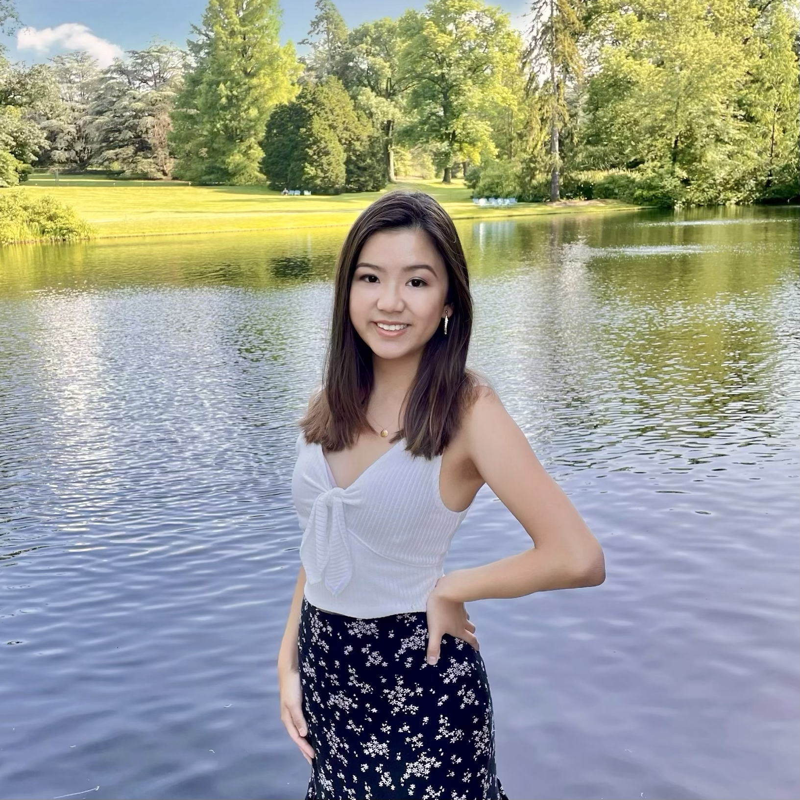

# Inflow

## Project Synopsis
Inflow is a platform built for brand managers to assemble teams of influencers for their next campaign without the hassle and inefficiencies of a brute-force search. Instead, our client companies will be able to initiate campaigns on our platform and have influencers apply to them. Influencers will similarly be saved from reading countless fruitless DMs, and instead have the opportunity to view what opportunities may be available from the brands they love and care about.

## Team Members
Member | Photo | Skills | Personal Traits | Desired Growth | Weaknesses
--- | --- | --- | --- | --- | ---
Tracy Cai |  | UI Design, Python, Swift | Efficient, detail-oriented |  Full-stack | Systems
Danny Du |  | User testing, Rapid prototyping, Programming | Loves coming up with ideas and features | Data visualization, using github | Well rounded but no area of deep expertise
Phillip Kim |  | AI, Programming | Hard-working and likes to code | Management, rapid prototyping | Indecisive
Eric Wang |  | Python, Java, HTML | Responsive and Communicative, Creative Thinker | Full Stack | Prone to Stress
Katherine Wu |  | Machine Learning, Programming | Organized, Can code | Building application layer, Rapid prototyping | Gets stressed when people procrastinate

## Team Communication
* Internal: iMessage Group
* External: @stanford Email
    * cpcai
    * dannydu
    * pkkim
    * kjwu00
    * ericw553
